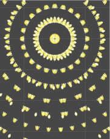
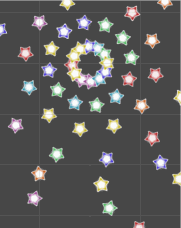
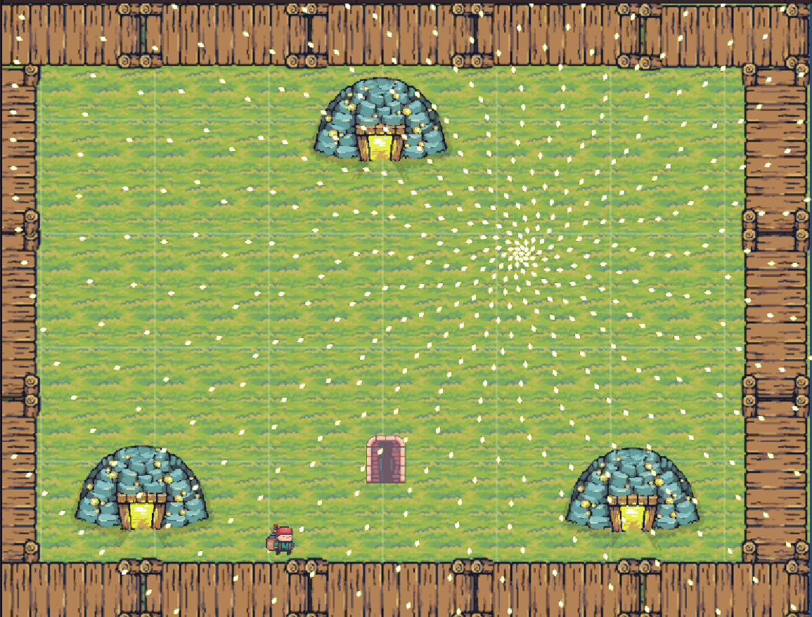
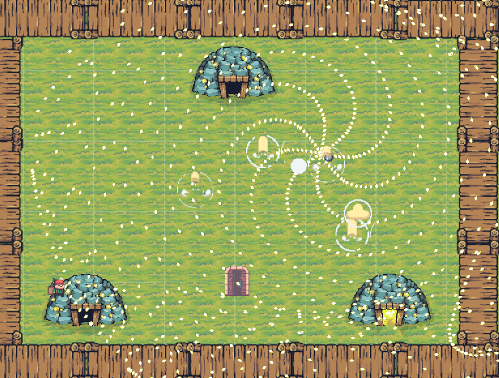

# Danmaku-Festival

#### Team 13：GensokyoCraft

> 感谢https://pixelfrog-assets.itch.io/tiny-swords  的开源素材，离开他们的慷慨分享我们无法在如此短时间内做到2D的图形化展示！

## 背景故事

> 你是人类村庄中一个普通的居民。某一天，当你如往常一样醒来时，却发现世界完全变了样！
>
> 人们开始用一种叫做“弹幕”的东西互相丢来丢去，——尽管它们看上去很快、很大，但却是完全无害的。
> 周围还开始出现各种神奇的妖怪和妖精。
>
> 更神奇的是，人们对此竟然完全没有感觉异样！
> 你的心中突然浮现出一个词，“梦逻辑”。那是这次异变的元凶吗？
> 为了搞清这一切的真相，你踏上了充满弹幕的旅途。

## 游戏类型

- 弹幕！

  1. 炫酷的子弹演出：

     

  2. 一点小小的随机性：

     

- 策略！

  1. 找到最合适的道路穿梭于子弹之间：

     

  2. 选择合适的组合：

     

  3. 有时，放慢速度会是更好的选择：

     

- 像素！

  
  
  - > still
  
    
  
    > run
  
    
  
    > Door in
  
    
  
    > Dead
  
    

## 操作介绍

| 操作  |    功能    |
| :---: | :--------: |
|   W   |    向上    |
|   S   |    向下    |
|   A   |    向左    |
|   D   |    向右    |
|   Q   | 捡拾/交互  |
|  Esc  |    退出    |
| Shift |  低速模式  |
| 鼠标  | 攻击聚焦点 |

